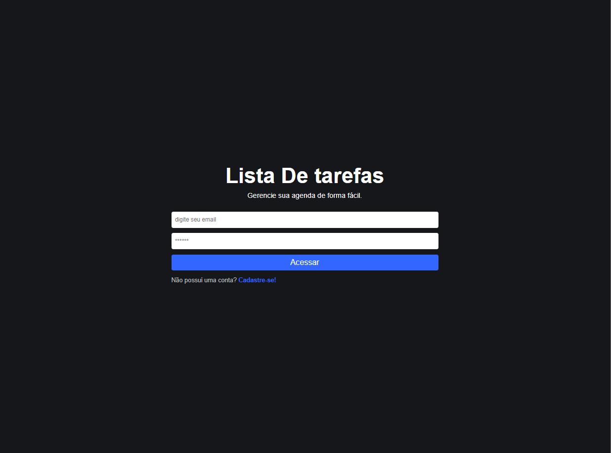
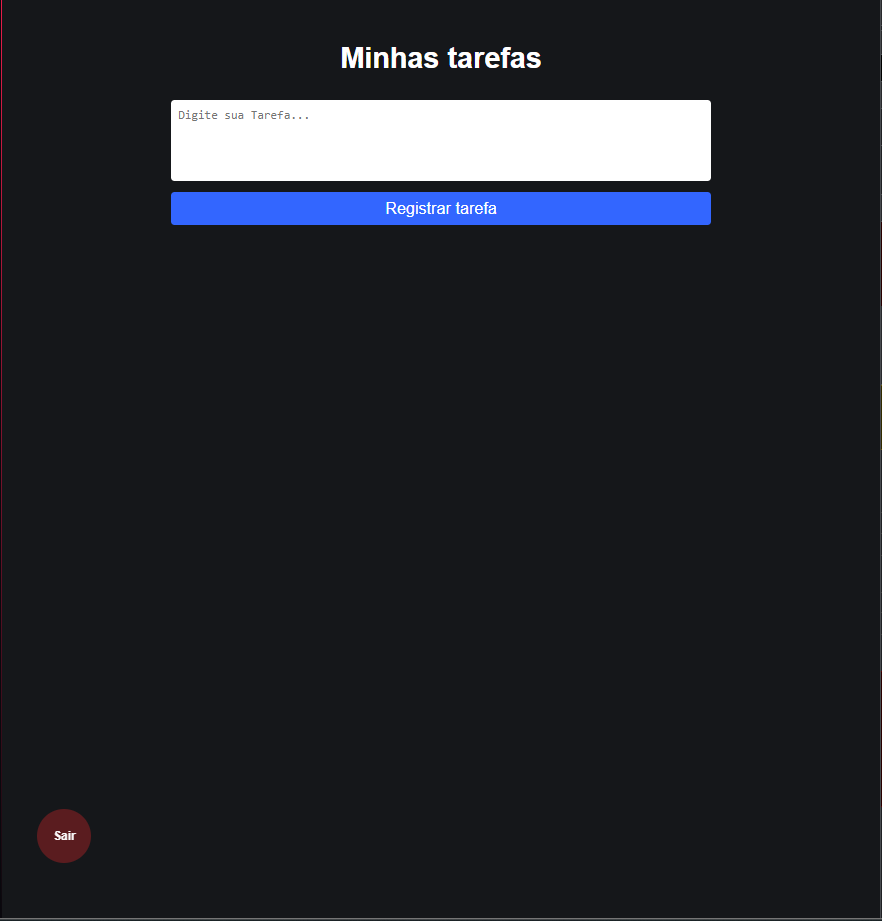
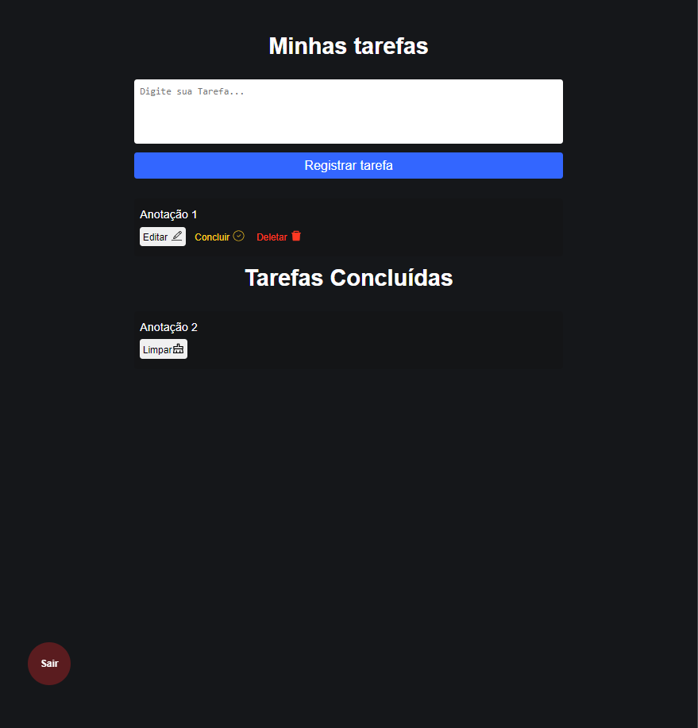

## O que vai encontar aqui

Tela de login

Ao acessar

Podemos criar itens e quando concluidas é criada uma lista para poder vizualizar as tarefas encerradas.

E você pode deslogar a sessão e acessar com outro usuário

Você pode usar `npm install` para instalar as dependencias.

você pode usar o `.env.example` para criar seu DB.
"# ToDo-List" 
